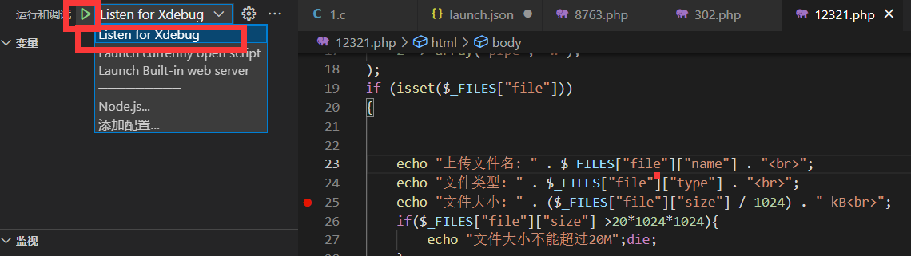

# PHP动态调试-Xdebug安装配置

## phpStudy+Xdebug+VSCode(Windows)

.png>)

查看目标调试站点的PHP版本 确定Xdebug插件版本 也可以查看PHPINFO判断版本 (需要安装对应PHP版本的Xdebug插件 更换PHP版本需要重新安装)

[https://xdebug.org/download](https://xdebug.org/download) Xdebug插件官方下载地址

.png>)

选择对应版本下载 (不标TS的版本为NTS)

将下载好的插件放在 PHPSTUDY安装目录\Extensions\php\PHP版本\ext\\

例 X:\phpstudy\_pro\Extensions\php\php7.3.4nts\ext\\

插件重命名为php\_xdebug.dll (为了美观好记 雾)

在php.ini 末尾添加配置 (php.ini位于 PHPSTUDY安装目录\Extensions\php\PHP版本\php.ini)

```
[Xdebug]
zend_extension=php_xdebug.dll
xdebug.client_port=8777
xdebug.client_host=127.0.0.1
xdebug.mode=debug
xdebug.remote_host=127.0.0.1
xdebug.remote_handler=dbgp
xdebug.start_with_request = yes
```

client\_port要与vscode配置一致

重启WEB(PHP进程)服务


.png>)

安装完毕 添加调试器配置

.png>)

修改为之前的端口

添加断点(快捷键 F9)后开始调试



访问目标调试页面

左侧出现变量即为成功调试

(注意 PHPSTUDY Apache环境默认有超时限制 超时返回 HTTP 500 - Internal Server Error 服务器内部错误)

.png>)

Apache 超时配置 <mark style="color:red;">(TODO)</mark>

X:\phpstudy\_pro\Extensions\Apache\*\conf\original\extra\httpd-default.conf


